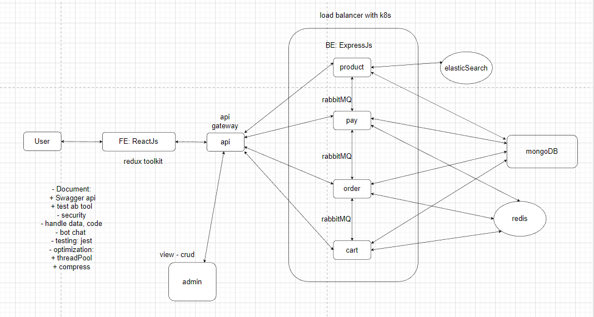

* Demo 1: Web ecommerce
--------------------------------------------------
+ Fe: reactJs
+ state: Redux Toolkit, hook
+ style: React Bootstrap
------------------------------------------------------------
+ Be: expressJs
+ microservice
+ deploy: docker -> Load Balancing with Kubernetes 
+ testing: jest
+ services: api(Api-gateway) , product, order, cart, pay.
+ DB: mongoDB, redis, elasticSearch
+ more : Document, Swagger, RabbitMQ , socket.io, test performance, Optimal, Design Patterns(NodeJS, mongoDB), handle data and code,security,bot chat, ...
----------------------------------------------------------------------------

---------------------------------------

